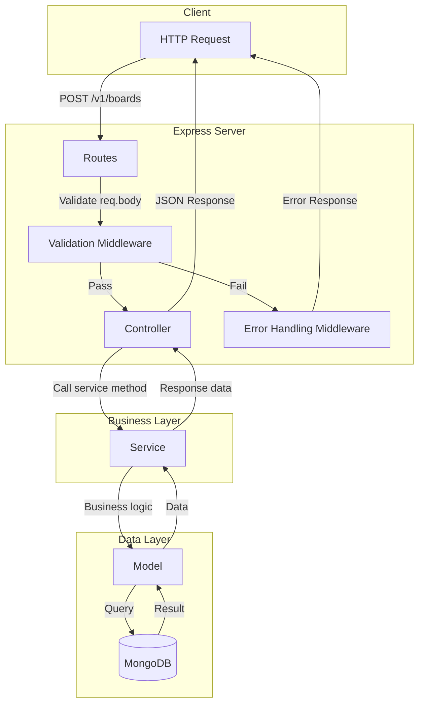
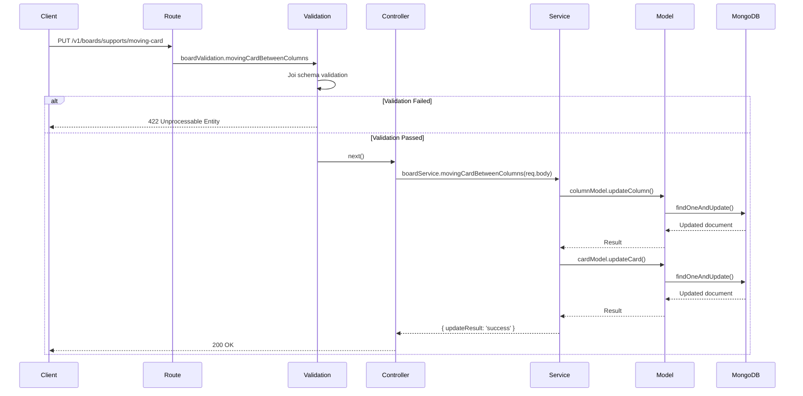
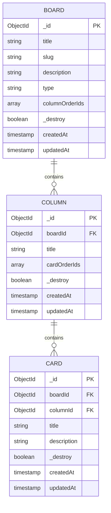

# Trello API

A RESTful API backend for a Trello-clone application built with Node.js, Express, and MongoDB.

## Author

**ngsouthbrother04** - [GitHub](https://github.com/ngsouthbrother04)

## 📋 Overview

This project implements a task management system similar to Trello, featuring boards, columns (lists), and cards. The API follows a clean three-layer architecture pattern ensuring maintainability and scalability.

## 🏗️ Architecture

### Three-Layer MVC Pattern

```
Request → Route → Validation → Controller → Service → Model → Database
```



### Request Flow Example



### Data Model Relationships



## 📁 Project Structure

```
src/
├── config/          # Environment, database, CORS configuration
├── controllers/     # HTTP request handlers
├── middlewares/     # Error handling, authentication (future)
├── models/          # MongoDB schemas & database operations
├── routes/
│   └── v1/          # API version 1 endpoints
├── services/        # Business logic layer
├── utils/           # Helpers, constants, validators
└── server.js        # Application entry point
```

## 🔌 API Endpoints

| Method | Endpoint | Description |
|--------|----------|-------------|
| `GET` | `/v1/boards` | Get all boards |
| `POST` | `/v1/boards` | Create a new board |
| `GET` | `/v1/boards/:id` | Get board details with columns & cards |
| `PUT` | `/v1/boards/:id` | Update board |
| `PUT` | `/v1/boards/supports/moving-card` | Move card between columns |
| `POST` | `/v1/columns` | Create a new column |
| `PUT` | `/v1/columns/:id` | Update column |
| `DELETE` | `/v1/columns/:id` | Delete column and its cards |
| `POST` | `/v1/cards` | Create a new card |
| `PUT` | `/v1/cards/:id` | Update card |

## 🛠️ Tech Stack

- **Runtime:** Node.js >= 18.x
- **Framework:** Express.js 4.x
- **Database:** MongoDB 6.x (Native Driver)
- **Validation:** Joi
- **Transpiler:** Babel (ES6+ support with path aliasing)
- **Linting:** ESLint

## 🚀 Getting Started

### Prerequisites

- Node.js >= 18.16.0
- Yarn >= 1.22.19
- MongoDB (local or Atlas)

### Installation

#### Cloning from repository

```bash
git clone https://github.com/ngsouthbrother04/trello-api.git
```

```bash
cd trello-api
```

#### Installing dependencies

```bash
yarn install
```

### Environment Variables

Create a `.env` file in the root directory:

```env
MONGODB_URI=
DATABASE_NAME=
LOCAL_DEV_APP_HOST=localhost
LOCAL_DEV_APP_PORT=8017
BUILD_MODE=dev
```

| Variable | Description | Example |
|----------|-------------|---------|
| `MONGODB_URI` | MongoDB connection string | `mongodb://localhost:27017` |
| `DATABASE_NAME` | Database name | `trello-db` |
| `LOCAL_DEV_APP_HOST` | Server host | `localhost` |
| `LOCAL_DEV_APP_PORT` | Server port | `8017` |
| `BUILD_MODE` | Environment mode | `dev` / `production` |

### Running the Application

```bash
# Development
yarn dev

# Production build
yarn build
yarn production
```

## 📄 License

This project is for educational purposes.

---
